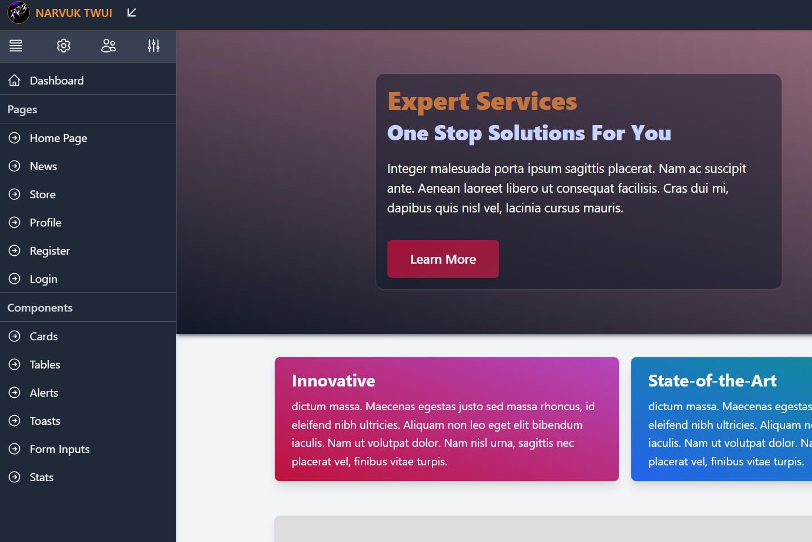

## Live Demo
Check out the live demo at [TWUI Demo](https://twui.narvuk.com).

---

## Developer Setup

### Prerequisites
Make sure you have the following installed:
- [Node.js](https://nodejs.org/)
- [npm](https://www.npmjs.com/) 
- [Ruby + DevKit](https://www.ruby-lang.org)

### Installation
1. Install Prerequisites, if you already have go to the next step
- Install Node.js:
- Install Ruby and DevKit (if not already installed):
- Follow the [Ruby installation guide](https://www.ruby-lang.org/en/documentation/installation/) and install the required DevKit.
2. Clone the repository: 
3. Run `npm run setup` to set up the Node.js and Ruby dependencies.
4. Run `npm run dev` This starts the dev http server for localhost:
5. Run `npm run watch` TailwindCSS CLI to watch for css changes:
6. Open your browser and go to `http://localhost:4000`.

**Note:** If the TailwindCSS CLI stops running or if you don't see CSS changes, rerun the CLI by running the watch command:

---

## Contributions To Narvuk TWUI
When contributing to or fixing issues in this repository, please follow the steps below to ensure your changes are implemented consistently and correctly. We monitor pull requests (PRs) to merge changes into the main branch.

### Follow these steps:
1. Make your changes in a new branch (ensure to follow our code style).
2. Test your changes locally to ensure everything works.
3. Create a pull request.
4. Wait for approval and discuss your changes if necessary.

We appreciate all contributions and will review them as soon as possible. Please be patient as we may take time to test and review your changes.

---

## Help and Support
If you encounter any issues or need assistance with the template, feel free to open an issue on our GitHub repository. Please provide as much detail as possible (e.g., error messages, steps to reproduce, screenshots) to help us resolve the issue efficiently.

We have also enabled discussions on this repository if you require community help or questions regarding Narvuk TWUI

We strive to respond and fix issues as quickly as possible. Your feedback is crucial to improving this project!

---

## License
This project is licensed under the MIT License - see the [LICENSE](LICENSE) file for details.
